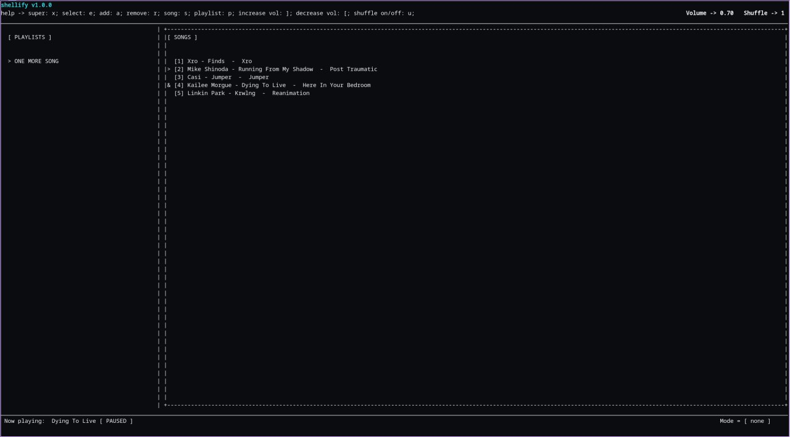

# shellify v1.2.0

shellify is a terminal based audio player written in god-chosen lang C for Linux.<br>
Built with sqlite3, [miniaudio](https://github.com/mackron/miniaudio) under the GPL-3.0 License.<br>



## Dependencies
- `miniaudio` - audio engine by [mackron](https://github.com/mackron/miniaudio)
- `sqlite3` - saving the data
- `ffmpeg` - you know

## Installation (Linux)
### Downloading the dependencies
For shellify to work correctly, you need to download all the dependencies listed above.

### Building
```bash
git clone https://github.com/nelson131/shellify.git
cd shellify
chmod +x install.sh
./install.sh
```

### Troubleshooting
If .desktop doesnt opening shellify, try to install xdg-terminal-exec

## Default shortcuts
| Key | Action |
|-----|--------|
| `LEFT/RIGHT` | Arrows for menus or focusing |
| `UP/BOTTOM` | Arrow for scrolling |
| `e` | Select |
| `f` | Pause the song |
| `a` | Enable adding mode |
| `r` | Enable removing mode |
| `ESC` | Disable any mode |
| `x` | Super |
| `]` | Increase the volume |
| `[` | Decrease the volume |
| `u` | Enable/Disable the shuffle |
| `q` | Quit |

## Configuration
HOME/.config/shellify/config is a configuration file.<br>
You can freely rebind shortcuts to suit for your own needs, define desc and<br>
enable or disable logging mode.
